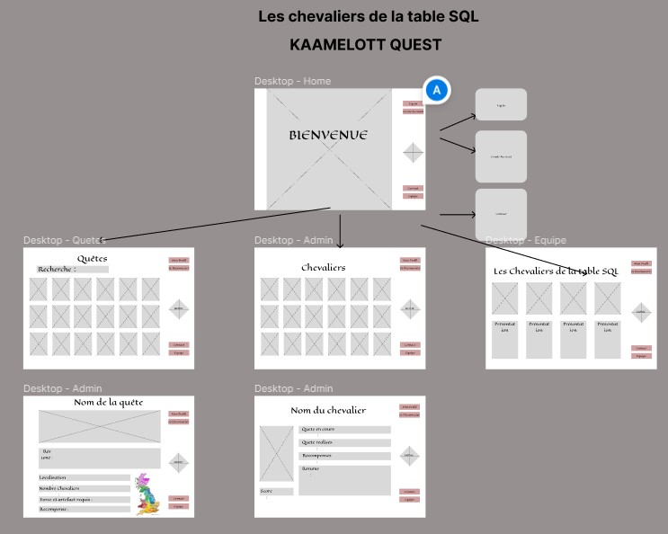

<div align='center'>
    <h1 id="top"><b>:crossed_swords: Kaamelott Quests :crossed_swords:</b></h1>
    
    <p>WCS PROJECT [Hackathon #2]</b></p>


</div>

 <p align="center">
    <a href="https://newaluigi.github.io/Intergalactic-tournament/"><strong>Explore the website »</strong></a>
    <br />
    <br />
    <a href="https://newaluigi.github.io/KaamelottQuests.svg/issues">Report Bug</a>
    ·
    <a href="https://newaluigi.github.io/KaamelottQuests.svg/issues">Request Feature</a>
  </p>
</div>

<details>
  <summary>Table of Contents</summary>
  <ul>
    <li><a href="#-about-the-project">About The Project</a></li>
    <li><a href="#-technologies">Technologies</a></li>
    <li><a href="#%EF%B8%8F-mock-up">Mock-up</a></li>
    <li><a href="#-installation">Installation</a></li>
    <li><a href="#-showcase">Showcase</a></li>
    <li><a href="#-ressources">Ressources</a></li>
    <li><a href="#-go-further">Go further</a></li>
    <li><a href="#-license">License</a></li>
    <li><a href="#%EF%B8%8F-contact">Contact</a></li>
  </ul>
</details>

---

## 🐔 **ABOUT THE PROJECT**

48 hours in team to discover and understand 𝗥𝗲𝗮𝗰𝘁, consuming an 𝗔𝗣𝗜 and build a website. The topic was Starwars universe and the consumption of an API with star war's characters. Initially the subject was about love encounter, but as we had already did love application for on the previous project we decided to produced about sport encounters, so in starwars the main one is pod racing tournament.
<br />
<br />
It's a front project, there is no back-end, so some random features are fake for the presentation.

<br />

<p align="right">(<a href="#top">back to top</a>)</p>

---

## 💻 **TECHNOLOGIES**

* Languages : 

* Style : 

* Framework Front : 

* Framework Back :  

* Database : 

* Design : 

* Organization : 

* Remote team work :   

* IDE : 

<br />

<p align="right">(<a href="#top">back to top</a>)</p>

---

## ✏️ **MOCK-UP**

### Figma

Example of the tournament list page :
<br />


### Color Reference

| Color             | Hex                                                                |
| ----------------- | ------------------------------------------------------------------ |
| background-color |  #000000 |
| main-color |  #ffe81f |
| lightsaber-color |  #ff0000 |


<br />

### Font Reference

| Font             | Ref                                                                |
| ----------------- | ------------------------------------------------------------------ |
| main-font | **fontStarWars** |
| title-font | **fontStarWars** |

<br />

### API

API shared for the hackathon :
https://github.com/Miadil/starwars-api

<p align="right">(<a href="#top">back to top</a>)</p>

---

## 💾 **INSTALLATION**

### Local installation:

1. clone the repo

```
git clone https://github.com/Newaluigi/Game_Date_Match.git
```

2. cd into cloned repo

```
cd repo
```
### Dependencies :

3. install dependencies

```
npm install
```
#### Specific packages on the project
* react-h5-audio-player

### Getting Started with Create React App :

This project was bootstrapped with [Create React App](https://github.com/facebook/create-react-app).

#### Available Scripts

In the project directory, you can run:

##### `npm start`

Runs the app in the development mode.\
Open [http://localhost:3000](http://localhost:3000) to view it in your browser.

The page will reload when you make changes.\
You may also see any lint errors in the console.

##### `npm test`

Launches the test runner in the interactive watch mode.\
See the section about [running tests](https://facebook.github.io/create-react-app/docs/running-tests) for more information.

##### `npm run build`

Builds the app for production to the `build` folder.\
It correctly bundles React in production mode and optimizes the build for the best performance.

The build is minified and the filenames include the hashes.\
Your app is ready to be deployed!

See the section about [deployment](https://facebook.github.io/create-react-app/docs/deployment) for more information.

##### `npm run eject`

**Note: this is a one-way operation. Once you `eject`, you can't go back!**

If you aren't satisfied with the build tool and configuration choices, you can `eject` at any time. This command will remove the single build dependency from your project.

Instead, it will copy all the configuration files and the transitive dependencies (webpack, Babel, ESLint, etc) right into your project so you have full control over them. All of the commands except `eject` will still work, but they will point to the copied scripts so you can tweak them. At this point you're on your own.

You don't have to ever use `eject`. The curated feature set is suitable for small and middle deployments, and you shouldn't feel obligated to use this feature. However we understand that this tool wouldn't be useful if you couldn't customize it when you are ready for it.

#### Learn More

You can learn more in the [Create React App documentation](https://facebook.github.io/create-react-app/docs/getting-started).

To learn React, check out the [React documentation](https://reactjs.org/).

##### Code Splitting

This section has moved here: [https://facebook.github.io/create-react-app/docs/code-splitting](https://facebook.github.io/create-react-app/docs/code-splitting)

##### Analyzing the Bundle Size

This section has moved here: [https://facebook.github.io/create-react-app/docs/analyzing-the-bundle-size](https://facebook.github.io/create-react-app/docs/analyzing-the-bundle-size)

##### Making a Progressive Web App

This section has moved here: [https://facebook.github.io/create-react-app/docs/making-a-progressive-web-app](https://facebook.github.io/create-react-app/docs/making-a-progressive-web-app)

##### Advanced Configuration

This section has moved here: [https://facebook.github.io/create-react-app/docs/advanced-configuration](https://facebook.github.io/create-react-app/docs/advanced-configuration)

##### Deployment

This section has moved here: [https://facebook.github.io/create-react-app/docs/deployment](https://facebook.github.io/create-react-app/docs/deployment)

##### `npm run build` fails to minify

This section has moved here: [https://facebook.github.io/create-react-app/docs/troubleshooting#npm-run-build-fails-to-minify](https://facebook.github.io/create-react-app/docs/troubleshooting#npm-run-build-fails-to-minify)

### Game installation:

In this repository the game is in /Star-Wars-Invaders, but for runing th eproject correcctly you need to move this flder outside the repository folder and launch the both. You can also find the repository of our teammate work with the game in one repository : https://github.com/wiwim51/Star-Wars-Invaders


<p align="right">(<a href="#top">back to top</a>)</p>

---

## 🔎 **SHOWCASE**

### Key features
* Animated homepage
* Menu burger
* Interractive tournament bracket
* Gallery with API
* Game
* List of tournaments with a countdown

<br />

### Details

<br />

#### Homepage
The homepage is simple but catchy : the site open with the music of starwars and the classic landing with the scrolling text of introduction.
<br />
<br />
<p align="center"> 

</p>
The menu burger open the menu on front with glassmorphism, and the hover on the li start a lightsaber effect.
<br />
<br />
<p align="center"> 

</p>

#### Knights page
On the header of this page you can see a countdown to the next tournament with a R2D2 body and a funny ad.
<br />
<br />
<p align="center"> 

</p>    
The main section of the page is composed with the cards of all the tournaments where you can see the details of the tournament.
<br />
<br />
<p align="center"> 

</p>
On the card you have a button to particpate and select your character, with a sound of R2D2 on the onclick.
<br />
<br />
<p align="center"> 

</p>
At the end of the page there is a section with fun facts
<br />
<br />
<p align="center"> 

</p>

#### Quests page
On this page the user can select his character, this one will be saved on the current tournament page.
There is an hover effect that change opacity.
<br />
<br />
<p align="center"> 

</p>

#### Contact & Team
At the begining we wanted to create a race game but because of the lack of time we produced a space invaders-like. The background change, you have one life to succeed.
<br />
<p align="center"> 

</p>
If the player lose there is a game over message, if he win it actualize the tournament bracket.
<br />
<p align="center"> 

</p>


<p align="right">(<a href="#top">back to top</a>)</p>

---

## 📚 **RESSOURCES**

### Data base


### Back


### Modal


### CSS Tips
* Lateral navbar

<br />

<p align="right">(<a href="#top">back to top</a>)</p>

---

## 🔨 **GO FURTHER**

* User connexion effective
* Contact form effective
* Add Post method
* Add a possibility to attibute one quest to a knight

<br />

<p align="right">(<a href="#top">back to top</a>)</p>

---

## 📜 **LICENSE**

No specific licence

<br />

<p align="right">(<a href="#top">back to top</a>)</p>

---

## ✉️ **CONTACT**

[](https://github.com/Newaluigi/)

<br />
<p align="right">(<a href="#top">back to top</a>)</p>
